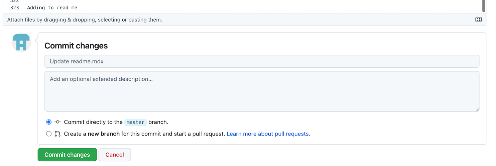

 # Git(Hub) 101

## Table of Contents
- [Git(Hub) 101](#github-101)
  - [Table of Contents](#table-of-contents)
  - [Prequisites](#prequisites)
  - [Optional Prequisites](#optional-prequisites)
  - [Overview](#overview)
- [Git vs Github](#git-vs-github)
  - [What is Git?](#what-is-git)
  - [What is Github?](#what-is-github)
  - [Github Alternatives and Tools](#github-alternatives-and-tools)
- [Walkthrough Lab](#walkthrough-lab)
  - [Cloning](#cloning)
  - [Branching](#branching)
    - [Checking Out Your Own Branch](#checking-out-your-own-branch)
    - [Checking out Other Branches](#checking-out-other-branches)
    - [Remote vs Local Branch](#remote-vs-local-branch)
  - [Saving and Committing Changes](#saving-and-committing-changes)
  - [Pushing up your changes](#pushing-up-your-changes)
      - [Local vs Remote Branch](#local-vs-remote-branch)
  - [Opening a Merge Request](#opening-a-merge-request)
- [Other Common Scenarios](#other-common-scenarios)
  - [Forks](#forks)
  - [Reverts and Resets](#reverts-and-resets)
  - [Rebases](#rebases)
  - [Merge Conflicts](#merge-conflicts)
  - [Finding Help](#finding-help)
- [Tools Demo](#tools-demo)
  - [VSCode](#vscode)
  - [Github Desktop](#github-desktop)
- [Github Console Features](#github-console-features)
  - [Issues](#issues)
  - [Branch Summary](#branch-summary)
  - [Versioning](#versioning)
  - [Discussions](#discussions)
  - [Projects](#projects)
  - [Wiki](#wiki)

---

## Prequisites
- [Create a github account](https://github.com) (if not already present)
- [Install git](https://git-scm.com/downloads)


## Optional Prequisites
- [Install Visual Studio Code](https://code.visualstudio.com/) (or use an editor of your choice) (link here)
- [Install github desktop](https://desktop.github.com/)

---
 
## Overview
Git is a version control tool that helps keep track of written code history and management as well as
coordinate work between multiple people writing into the same code base

<br/>

Quick Terminology (will go into further depth later):
- Branch: Independent copy of the repository/project. Changes do not affect other active copies.
- Commit: A summary of saved changes within the project, packaged as a single instance
- Pull Request: An operation to submit changes from the copy back into the main

Simple Flow:

<br/>


*note: master branches are now referred to as main branches

<br/>

---

# Git vs Github
Whereas Git is the tool which does bulk of the work, Github is the online interface that helps you
visualize all the operations you are performing and even perform them for you in some cases. It also
stores the repository online so your work is no longer just local to your computer hard drive
 
---

## What is Git?
 
Git is a CLI (command line interface) program used primarily within a terminal. i.e.
 
- Mac/Linux built in terminal
 
- Windows options via [Git Bash](https://gitforwindows.org/)
 
You might've heard of commands such as `ls`, `echo`, or `pwd` that list your current directory, it's contents, and such
 
---

**Usage Examples**
```
git checkout <branch name>
git add <file>
git commit -m "<commit message>"
```
Format is usually `<program name> <command> <options>`
 
In this case, `git add <file>`

---
 
## What is Github?
 
**Diagrams/Images**
 
---

## Github Alternatives and Tools


[GitLab](https://about.gitlab.com/)

[BitBucket](https://bitbucket.org/product)
 
[Github Desktop](https://desktop.github.com/)
 
---
# Walkthrough Lab
 
## Cloning

**Explanation**

Cloning a repository refers to downloading a copy of the main branch onto your hard drive.
Changes you make to that code won't reflect the online copy until those changes are "committed" and "pushed".

The git file or file source link is needed to clone it. Github itself offers a multitude of ways to clone a repo, which you can find with the green `Code` button at the top right of the github repo page:

<br/>


- HTTPS
- SSH
- GitHub CLI
- GitHub Desktop
- Download ZIP

**Objectve**
 
- Get a local workable copy of the repo

Command: `git clone <link to .git file>`

Note: 
* Preferably you should organize your projects and clone into some sort of documents/tutorials directory
* Not everyfile will be dumped into where you run the command, but the contents of the copy will be put into another folder with the project name as its title
  * i.e. cloning this repo into `~/Documents` won't create `~/Documents/README.md`, `~/Documents/<all your files>`, etc but rather `Documents/github-bootcamp/<all your files>`

---
 
## Branching
 
**Explanation**
 
**Diagrams/Images**
 
---
 
### Checking Out Your Own Branch
 
**Explanation**
 
**Diagrams/Images**
 
---
 
### Checking out Other Branches
 
**Explanation**
 
**Diagrams/Images**

---

### Remote vs Local Branch
 
**Explanation**
 
**Diagrams/Images**
 
---
 
## Saving and Committing Changes
 
If you think of each line of code as an order item, then a commit is a cardboard box containing that code (those items), with a label called a `commit message` and a random unique ID about the contents of the box.

Before you "ship" or "push" your commits off to the remote branch for github to keep track of, you must first add the relevant files, then commit them under a commit message. To stick to analogy, find the relevant items, and put them in the box.

Via terminal:
- `git add <file>`
  - May be `<path to file>` if your terminal is not in the same working directory as the file you want to add
  - To add all saved changes across all files within your folder and its subfolders, you can `.` e.g. `git add .` Be careful with this as sometimes you made changes you might want to revert or not push up and this catch-all function will not care
- `git commit -m "<message>"`
  - This will officially "package" your added code under a summary message of all the saved changes. e.g. `git commit -m "added error handling"`

Via Github:



As you can se here, I added a line via the online github text editor `Adding to read me` and GitHub below the file gives me the option to save that line as it's own commit. It also pre-populates the commit message with a generic `Update readme.mdx` and lets me branch off or submit it directly to whatever the edited branch is (in this case master)

<br/>

**Lab Objectve**
- Create a file within the folder `lab_files` named `<username>.md`
- Add to the file a short passage about you as such
```
# Sammy
## Developer Supreme at GoDaddy

About me:
I like long walks on the beach with my dog
```
- Save said file
- Add the file to git
- Commit the file to git
 
Note:
- You can add and commit as many times as you want without affecting the remote branch. Just let it be known it might messy when you see 1000 commits in your repository of micro changes.
- Commands such as `git log` can show you the commit history directly within the terminal
- Commands such as `git diff` can show you in the terminal the changes you made to your code
- Github trivializes the two above this with its interface but it's good to know

---
 
## Pushing up your changes
 
**Explanation**
 
#### Local vs Remote Branch
 
**Diagrams/Images**
 
---
 
## Opening a Merge Request
 
**Explanation**
(includes commenting and approving/denying, squashing)
 
**Diagrams/Images**

---
 
# Other Common Scenarios

 
## Forks
 
**Explanation**
 
**Diagrams/Images**
 
---
## Reverts and Resets
 
**Explanation**
 
**Diagrams/Images**
 
---
## Rebases
 
**Explanation**
 
**Diagrams/Images**
 
---
 
## Merge Conflicts
 
**Explanation**
 
**Diagrams/Images**
 
---
 
## Finding Help
 
**Explanation**

**Diagrams/Images**
 
---
 
# Tools Demo
 
## VSCode
 
## Github Desktop

 
---
 
# Github Console Features

 
## Issues
 
**Explanation**
 
**Diagrams/Images**
 
---
 
## Branch Summary
 
**Explanation**
 
**Diagrams/Images**

---

## Versioning
 
**Explanation**
 
**Diagrams/Images**
 
---
 
## Discussions
 
**Explanation**
 
**Diagrams/Images**
 
---
 
## Projects
 
**Explanation**
 
**Diagrams/Images**
 
---
 
## Wiki
 
**Explanation**
 
**Diagrams/Images**