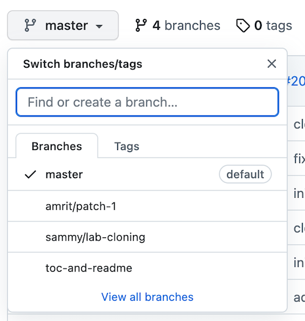
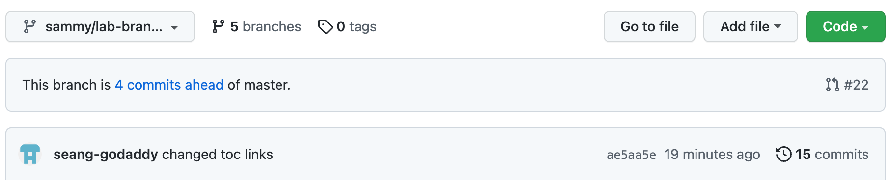
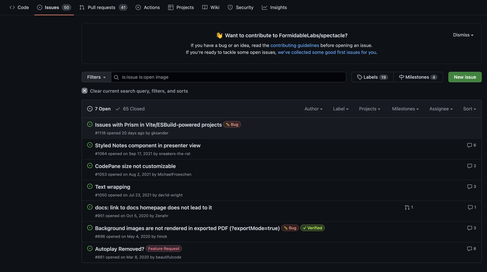
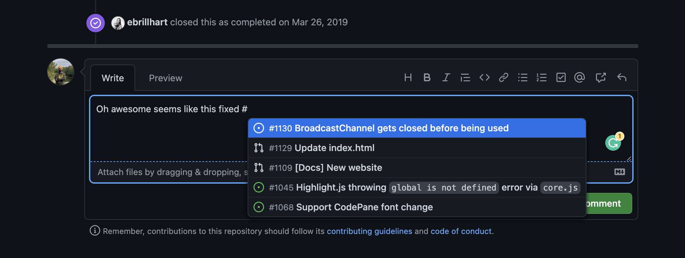
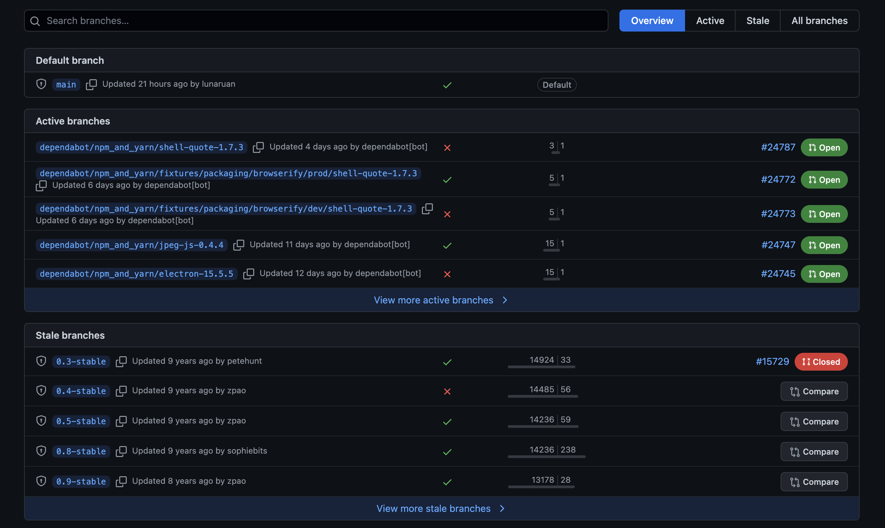
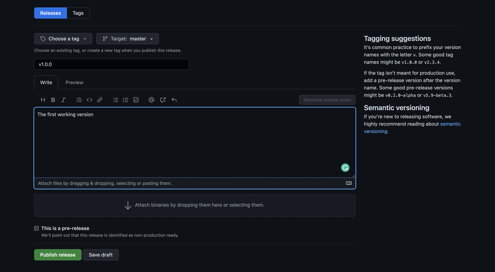
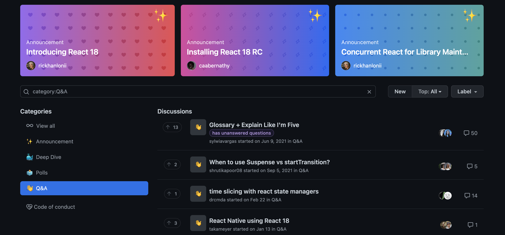
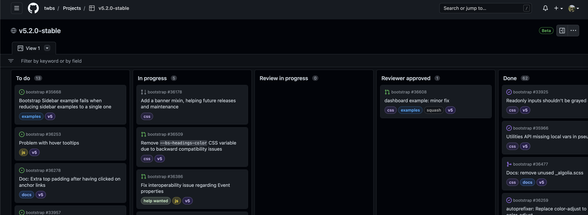
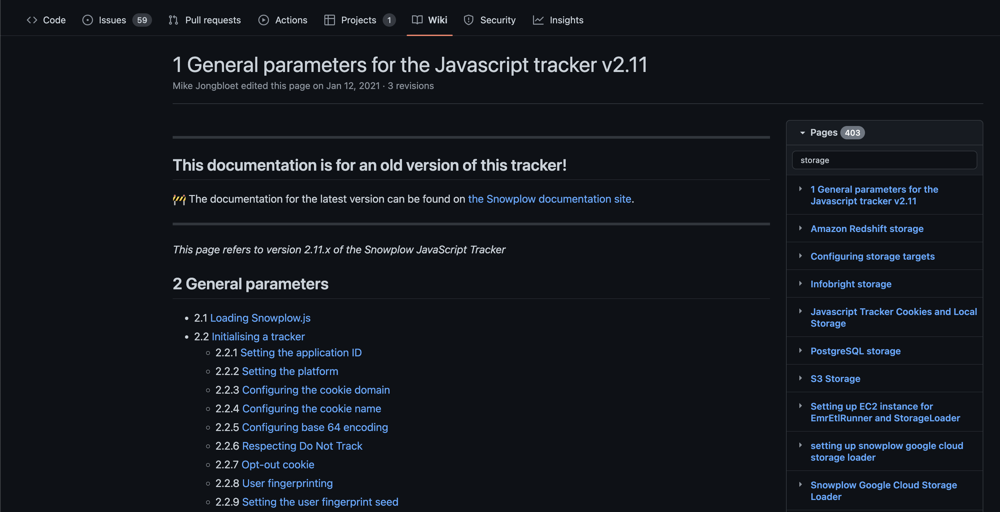

 # Git(Hub) 101

## Table of Contents
- [Git(Hub) 101](#github-101)
  - [Table of Contents](#table-of-contents)
  - [Prequisites](#prequisites)
  - [Optional Prequisites](#optional-prequisites)
  - [Overview](#overview)
- [Git vs Github](#git-vs-github)
  - [What is Git?](#what-is-git)
  - [What is Github?](#what-is-github)
  - [Github Alternatives and Tools](#github-alternatives-and-tools)
- [Walkthrough Lab](#walkthrough-lab)
  - [Cloning](#cloning)
  - [Branching](#branching)
    - [Checking Out Branches](#checking-out-branches)
    - [Remote vs Local Branch](#remote-vs-local-branch)
  - [Saving and Committing Changes](#saving-and-committing-changes)
  - [Pushing up your changes](#pushing-up-your-changes)
  - [Opening a Merge Request](#opening-a-merge-request)
- [Other Common Scenarios](#other-common-scenarios)
  - [Forks](#forks)
  - [Reverts and Resets](#reverts-and-resets)
  - [Rebases](#rebases)
  - [Merge Conflicts](#merge-conflicts)
  - [Finding Help](#finding-help)
- [Tools Demo](#tools-demo)
  - [VSCode](#vscode)
  - [Github Desktop](#github-desktop)
- [Github Console Features](#github-console-features)
  - [Issues](#issues)
  - [Branch Summary](#branch-summary)
  - [Versioning](#versioning)
  - [Discussions](#discussions)
  - [Projects](#projects)
  - [Wiki](#wiki)

---

## Prequisites
- [Create a github account](https://github.com) (if not already present)
- [Install git](https://git-scm.com/downloads)


## Optional Prequisites
- [Install Visual Studio Code](https://code.visualstudio.com/) (or use an editor of your choice) (link here)
- [Install github desktop](https://desktop.github.com/)

---
 
## Overview
Git is a version control tool that helps keep track of written code history and management as well as
coordinate work between multiple people writing into the same code base

<br/>

Quick Terminology (will go into further depth later):
- Branch: Independent copy of the repository/project. Changes do not affect other active copies.
- Commit: A summary of saved changes within the project, packaged as a single instance
- Pull Request: An operation to submit changes from the copy back into the main

Simple Flow:

<br/>


*note: master branches are now referred to as main branches

<br/>

---

# Git vs Github
Whereas Git is the tool which does bulk of the work, Github is the online interface that helps you
visualize all the operations you are performing and even perform them for you in some cases. It also
stores the repository online so your work is no longer just local to your computer hard drive
 
---

## What is Git?
 
Git is a CLI (command line interface) program used primarily within a terminal. i.e.
 
- Mac/Linux built in terminal
 
- Windows options via [Git Bash](https://gitforwindows.org/)
 
You might've heard of commands such as `ls`, `echo`, or `pwd` that list your current directory, it's contents, and such
 
---

**Usage Examples**
```
git checkout <branch name>
git add <file>
git commit -m "<commit message>"
```
Format is usually `<program name> <command> <options>`
 
In this case, `git add <file>`

---
 
## What is Github?
 
**Diagrams/Images**
 
---

## Github Alternatives and Tools


[GitLab](https://about.gitlab.com/)

[BitBucket](https://bitbucket.org/product)
 
[Github Desktop](https://desktop.github.com/)
 
---
# Walkthrough Lab
 
## Cloning

**Explanation**

Cloning a repository refers to downloading a copy of the main branch onto your hard drive.
Changes you make to that code won't reflect the online copy until those changes are "committed" and "pushed".

The git file or file source link is needed to clone it. Github itself offers a multitude of ways to clone a repo, which you can find with the green `Code` button at the top right of the github repo page:

<br/>


- HTTPS
- SSH
- GitHub CLI
- GitHub Desktop
- Download ZIP

**Objective**
 
- Get a local workable copy of the repo

Command: `git clone <link to .git file>`

Note: 
* Preferably you should organize your projects and clone into some sort of documents/tutorials directory
* Not every file will be dumped into where you run the command, but the contents of the copy will be put into another folder with the project name as its title
  * i.e. cloning this repo into `~/Documents` won't create `~/Documents/README.md`, `~/Documents/<all your files>`, etc but rather `Documents/github-bootcamp/<all your files>`

---
 
## Branching
 
 A branch is an independent copy of the repository. Changing one branch will not change another. Branches typically follow a hierarchy where the main branch rarely changes and has the most stable and working version. There may also be developer, test, and feature branches with their own unique changes that adopt each other in at some point. 

 Branches can be based off of any other branch, or any other commit. When put that way, a branch is really nothing but the latest commit in a culmination of isolated commits (isolated as in saved in not actively affecting other branches, unless those branches choose to take them in manually).

<br/>

A little more complex diagram:

<br/>


People typically only work on mostly one, if not sometimes a few unrelated branches, at a time. Even then they don't become complex webs of related commits. Just keep on coding and you'll see it's easier to conceptualize than a lot of graphs portray
 
---
 
### Checking Out Branches
 
When you want to make or "checkout" a new branch, you can do so via the terminal or github. Think of "checking out" the same way you would a library book, except there's unlimited copies.

Via terminal:
- To make a new branch: `git checkout -b <new branch name>`
- To view other branches:
  - When you initially clone a repo you generally only have what branches already existed at time of cloning and any new branches you've made
  - If someone makes a new branch you'd like to see, after you've cloned it, you will need to
    - To download the latest respository "state": `git fetch` (will explain more next slide)
    - To actually switch to a branch after update: `git checkout <branch name>`
  - Else you can switch to the branches you already know you have
    - If a branch you checked out is "out of date" (someone made )

Via Github:

- On the top right of the repo page, you'll see the branch icon with the name of the current branch you are viewing. From here, you can view (aka check out) other people's branches or create a new branch by typing the a name in the search bar (provided that branch name doesn't already exist)


 

 Note:
- The naming of a branch typically has conventions dictated by your team or project. Examples include
  - `name/title` e.g. `robert/login-page`
  - `scope/title`  e.g. `bugfix/incorrect_sum`
  - `title` e.g. `center_login_div`

**Lab Objectve**
 
- Checkout an existing branch `sammy/aboutme` and notice the new file under `/lab_files/sammy.md`
- Checkout the main branch again (titled master)
- Checkout a new branch with convention `<your name>/aboutme`

<br/>

---

## Remote vs Local Branch
 
A remote branch is the saved branch data as known by your online Github account.

A local branch is the saved branch data as known by your hard drive.

<br/>

If I make changes to my aboutme file in my editor, those changes only exist on my computer. If you try to fetch and pull my changes, you won't see the changes I've saved since I haven't modified my remote branch. AKA github.com doesn't know I've made those changes because I haven't "told" github about it yet; I haven't "pushed up" those changes. Therefore it can't communicate to you the changes I made and you cannot view them. The same goes for everyone else's branches. Whatever you `File > Save` or `Cmd + S` will not immediately be known by github.

<br/>

---

## Saving and Committing Changes

A change in git is defined as creating/removing/updating/deleting a file or a line of code. It could be as simple as adding a new line in a `README.md` file.
A commit in git is defined as an atomic piece of work that could contain one or multiple changes in it.  
If you think of each line of code or change as an item in an order, then a commit is a neat little packaged cardboard box containing those items (changes), with a "package label" referred to as a `commit message` and a random unique ID known as `commit hash` or `commit number` about the contents of the box.

Before you "ship" or "push" your commits off to the remote branch for github to keep track of, you must first add the relevant files, then commit them under a commit message. To stick to analogy, find the relevant items, and put them in the box.

Via terminal:
- `git add <file>`
  - May be `<path to file>` if your terminal is not in the same working directory as the file you want to add
  - To add all saved changes across all files within your folder and its subfolders, you can `.` e.g. `git add .` Be careful with this as sometimes you made changes you might want to revert or not push up and this catch-all function will not care
- `git commit -m "<message>"`
  - This will officially "package" your added code under a summary message of all the saved changes. e.g. `git commit -m "added error handling"`

Via Github:


As you can se here, I added a line via the online github text editor `Adding to read me` and GitHub below the file gives me the option to save that line as it's own commit. It also pre-populates the commit message with a generic `Update readme.mdx` and lets me branch off or submit it directly to whatever the edited branch is (in this case master)

<br/>

**Lab Objectve**
- Create a file within the folder `lab_files` named `<username>.md`
- Add to the file a short passage about you as such
```
# Sammy
## Developer Supreme at GoDaddy

About me:
I like long walks on the beach with my dog
```
- Save said file
- Add the file to git
- Commit the file to git
 
Note:
- You can add and commit as many times as you want without affecting the remote branch. Just let it be known it might messy when you see 1000 commits in your repository of micro changes.
- Commands such as `git log` can show you the commit history directly within the terminal
- Commands such as `git diff` can show you in the terminal the uncommitted changes you made to your code
- Github trivializes the two above this with its interface but it's good to know

---
**Diagrams/Images**

 
---
 
## Pushing up your changes
 
When you have your commits ready on your local branch, it's time to have those very changes be reflected and updated on github via a "push".
Afterwards your changes are saved in the cloud and can be viewed out by whoever else has access to that project, as well as working as a backup
in case your computer goes wacko.

Via terminal:
- `git push`
- If your branch is brand new, git may tell you to run `git push --set-upstream origin <branch name>` of which you only need copy paste and re-run

Objective
- Push your branch commits to GitHub
- View your branch on github and view its commits
- Click a commit number to see the changes under it

Visual:

Above the listed files, GitHub will show the most recent commit to that branch, the author of said commit, the commit number,
the time committed, and the total amount of commits. Clicking on that total number will show you a history and will let you
examine each commit and its packaged/summarized changes



---
 
## Opening a Merge Request
 
A merge request (MR) is an official "form" that says "hey, I want to put this code, into that branch" where you specify the "target branch" you want to inherit your branch's code. 
Usually it's the new feature into the main branch. Sometimes referred to as a pull request (PR), an MR/PR allows others to easily view the summarized
changes (all files' deletes and adds) as well as comment on them and approve/deny the PR.

When you push a new branch for the first time to remote, git may even suggest you open a PR for it, as you'll a message along the lines of:
```
remote: Create a pull request for 'sammy/lab-pushing' on GitHub by visiting:
remote:      https://github.com/asingh1-godaddy/github-bootcamp/pull/new/sammy/lab-pushing
```
and you just click on the link

<br/>

If Github determines your code is good (passes certain automated steps that may be there on setup), it will let you merge your branch into a target branch.
It is then good practice to delete your branch after it is merged. Or if your changes are no longer needed you may simply close the PR as well.

Note: 
- You may also get rid of your branch locally by running `git branch -d <branch name>`
- You can list all the branches you have downloaded locally by running `git branch`, to ensure your branch is actually deleted
- Squashing and merging (click on arrow next to Merge button on a PR) will allow you to consolidate all your changes into a single commit rather than X number of commits
- Try to notice a few things about what you see, namely the tabs and branch commit history

---
 
# Other Common Scenarios
---
## Status
The git status command displays the state of the working directory and the staging area. It lets you see which changes have been staged, which haven't, and which files aren't being tracked by Git.

---
 
## Forks
**Explanation**
A fork creates a completely independent copy of Git repository.
Forks are a great way of creating independent copies and contributing to open-source, without necessary having access to the "main" repository.
Forks are commonly used for open-source contribution and having safe copies for libraries. Forks by default would have two remotes setup. 
The origin repository is saved as upstream and the forked repository is saved as origin. Both are retained so that the developers can interact with both repositories according to their scenario and choice.

---
**Diagrams/Images**
[Live demo](https://github.com/facebook/react)
---
## Reverts and Resets
Ways of undoing changes made in a commit
---
### Revert
By reverting a certain commit, we create a new commit that contains the reverted changes!


---
### Reset
It can happen that we committed changes that we didn't want later on. Maybe it's a WIP commit, or maybe a commit that introduced bugs! 🐛 In that case, we can perform a git reset.

A git reset gets rid of all the current staged files and gives us control over where HEAD should point to.

---

### Soft Reset
**Explanation**
A soft reset moves `HEAD` to the specified commit (or the index of the commit compared to `HEAD`), without getting rid of the changes that were introduced on the commits afterward!
 


---

### Hard Reset
Sometimes, we don't want to keep the changes that were introduced by certain commits. Unlike a soft reset, we shouldn't need to have access to them any more. Git should simply reset its state back to where it was on the specified commit: this even includes the changes in your working directory and staged files! 💣
 


---

## Merge Conflicts
Having multiple branches is extremely convenient to keep new changes separated from each other, and to make sure you don't accidentally push unapproved or broken changes to production. Once the changes have been approved, we want to get these changes in our production branch!

One way to get the changes from one branch to another is by performing a git merge!
--- 


Although Git is good at deciding how to merge branches and add changes to files, it cannot always make this decision all by itself 🙂 This can happen when the two branches we're trying to merge have changes on the same line in the same file, or if one branch deleted a file that another branch modified, and so on.
---
If we want to merge dev into master, this will end up in a merge conflict: would you like the title to be Hello! or Hey!?
When trying to merge the branches, Git will show you where the conflict happens. We can manually remove the changes we don't want to keep, save the changes, add the changed file again, and commit the changes 🥳

Yay! Although merge conflicts are often quite annoying, it makes total sense: Git shouldn't just assume which change we want to keep.


---

## Rebases
We just saw how we could apply changes from one branch to another by performing a git merge. Another way of adding changes from one branch to another is by performing a git rebase.

A git rebase copies the commits from the current branch, and puts these copied commits on top of the specified branch.
A big difference compared to merging, is that Git won't try to find out which files to keep and not keep. The branch that we're rebasing always has the latest changes that we want to keep! You won't run into any merging conflicts this way, and keeps a nice linear Git history.

This example shows rebasing on the master branch. In bigger projects, however, you usually don't want to do that. A git rebase changes the history of the project as new hashes are created for the copied commits!

Rebasing is great whenever you're working on a feature branch, and the master branch has been updated. You can get all the updates on your branch, which would prevent future merging conflicts! 😄 


---
 
## Finding Help

When it comes to git, or any computer science topic for that matter, there are always multiple ways of getting help. There are screenshots, videos, podcasts, documentation, forums and dozen other forms of learning.
Getting help for git could be done in multiple ways.

### Man page
`man` command is one of the most helpful tools on linux and MacOS. For windows, you can get same info on [Git SCM Docs](https://git-scm.com/docs/git-help/2.18.0)
You can also use `--help` flag to get more info about each command.

Examples: (!Demonstrate)
* `man git`
* `git --help`
* `git add --help`

---

### Stack overflow
One of the most helpful resource for any dev is no different for git specifically. Simply google or search on StackOverflow your command or question, most of these times you will find exact question being asked by someone else, and there would be a nice little (sometimes not so little) answer waiting for you.

* !Demonstrate

---
### Git SCM Docs
The official and comprehensive man pages that are included in the Git package itself.
These are basically the web version of the help pages that are in the CLI tool as well. 
The official and comprehensive man pages that are included in the Git package itself.

https://git-scm.com/docs

If you are more of a video person, you can use Youtube to your advantage and learn from some amazing videos out there.

---
 
# Tools Demo
There is vast support for git in most IDEs and there are dedicated desktop tools out there to decrease the amount of git commands you have to type. If using git CLI doesn't seem like your thing, most of the scenarios are covered by these clients and tools.
Few common examples are:
 
## VSCode
!Demonstrate
 
## Github Desktop
!Demonstrate
 
---
 
# Github Console Features
Github is not just a place to store your code, it has also become a place to get help, track work, maintain documentations, encourage discussions and provide help to the users of your repository.
Hence, github has a line of products meant to help you in all of these scenario. We can briefly go over them.
 
## Issues (!Demonstrate)

According to github.com
> Issues let you track your work on GitHub, where development happens. When you mention an issue in another issue or pull request, the issue's timeline reflects the cross-reference so that you can keep track of related work. To indicate that work is in progress, you can link an issue to a pull request.
---
Few reported problems on an open source library repository.

* [Example Link](https://github.com/facebook/react/issues)

---
You can reference these issues later in pull requests and reflect that a certain code change may fix an issue.


---
 
## Branch Summary
A summarized view of the various branches found in github that contains info about recent branches, authors and commit comparison between multiple branches.

* [Example Link](https://github.com/facebook/react/branches)

---

## Versioning/Tagging/releases
A way of marking and labelling certain points in history for milestones and a version release. Similar to how iOS, Android have versions, all softwares could be marked with versions.

* [Example Link](https://github.com/snowplow/snowplow/releases)

---
 
## Discussions
A way for repository authors to notify and interact with the users of the repository. It is a centralized space for discussions, announcements, Q/A, Polls etc.

* [Example Link](https://github.com/reactwg/react-18/discussions/categories/q-a)
 
---
 
## Projects
Kanban-like board for tracking work and progress on a project. You can reference PRs and issues inside a project.

* [Example Link](https://github.com/orgs/twbs/projects/3)

---
 
## Wiki
 
A centralized place to store documentation and how-to pages. This option is used rarely in repositories since most of the authors maintain documentation under `README.md` files

* [Example Link](https://github.com/snowplow/snowplow/wiki)
